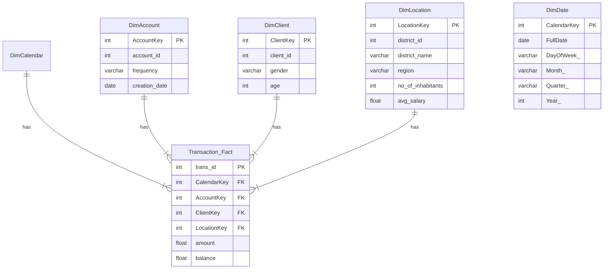

# Data Warehouse for Banking Analytics (DBS: B9DA111)

## Project Overview

This project is a proof-of-concept data warehousing and business intelligence solution developed for the **Data Storage Solutions for Data Analytics (B9DA111)** module at Dublin Business School. The objective is to design, implement, and analyze a dimensional data model to derive business intelligence from an existing data source.

The project uses a real-world financial dataset to build a complete ETL (Extract, Transform, Load) pipeline using **Microsoft SQL Server Integration Services (SSIS)**. The resulting data warehouse is then used to create reports and interactive dashboards in **SSRS** and **Tableau** to answer key business questions related to customer demographics, regional economic performance, and loan risk analysis.

This repository contains all the necessary SQL scripts, SSIS packages, and documentation for the project.

## Table of Contents
1.  [Assignment Context](#assignment-context)
2.  [Data Source](#data-source)
3.  [Business Vision & Requirements](#business-vision--requirements)
4.  [System Architecture](#system-architecture)
5.  [Data Warehouse Schema](#data-warehouse-schema)
6.  [Technologies Used](#technologies-used)
7.  [ETL Implementation Details](#etl-implementation-details)
8.  [How to Run This Project](#how-to-run-this-project)
9.  [Project Structure](#project-structure)
10. [Contributors](#contributors)

## Assignment Context

-   **Module Title:** Data Storage Solutions for Data Analytics
-   **Module Code:** B9DA111
-   **Programme:** MSc in Data Analytics / Jan 2025 Intake
-   **Assessment:** Practical, Report, Presentation

This project fulfills the requirements of Tasks 1, 2, and 3 of the assessment brief, covering the design, implementation, and ETL process for a dimensional data warehouse.

## Data Source

The data used for this project is a real-world, anonymized financial dataset from a Czech bank, originally provided for the **PKDD '99 (Principles of Data Discovery and Knowledge Discovery) conference Discovery Challenge**. This fulfills the assignment requirement to use a non-Kaggle data source.

-   **Original Source:** [PKDD '99 Discovery Challenge](https://lisp.vse.cz/pkdd99/Challenge/challenge.htm)
-   **Description:** The dataset contains information about clients, their accounts, transactions, loans, and demographic data for the associated districts. It consists of 8 separate tables (`account`, `client`, `disp`, `district`, `card`, `loan`, `order`, `trans`).

## Business Vision & Requirements

#### Subject Area
The project focuses on the **Analysis of Retail Banking Transactions** to drive business growth and manage risk.

#### Stakeholders
-   **Executive Management:** For high-level overviews of regional performance and overall cash flow.
-   **Marketing Department:** To understand customer demographics and target campaigns for financial products effectively.
-   **Risk Management Department:** To analyze loan data and identify correlations between district economic factors and loan defaults.
-   **Regional Branch Managers:** To monitor the performance of their specific districts and identify local opportunities.

#### Business Vision
To empower decision-makers with clear, actionable insights into customer behavior and regional economic factors. By centralizing transaction, client, and demographic data, we aim to improve marketing ROI, manage loan risk more effectively, and identify opportunities for regional growth.

## System Architecture

The project follows a standard ETL architecture with a clear separation between operational source systems and the analytical data warehouse.

#### Source Databases
To simulate a real-world operational environment, the raw CSV data was first loaded into three separate, normalized databases, each representing a different business domain:
1.  **`Customer_CRM_DB`:** Contains the `client` and `district` tables.
2.  **`Core_Banking_DB`:** Contains the `account`, `loan`, `card`, and `disp` tables.
3.  **`Transactional_Ledger_DB`:** Contains the high-volume `trans` and `order` tables.

#### Destination Data Warehouse
The destination is a single, dimensional data warehouse named **`Banking_DW`**, designed using a Star Schema.

## Data Warehouse Schema

A Star Schema was chosen for its simplicity, query performance, and ease of use with BI tools like Tableau. It consists of a central fact table surrounded by descriptive dimension tables.



## Technologies Used
-   **Database:** Microsoft SQL Server
-   **Database Management:** SQL Server Management Studio (SSMS)
-   **ETL Tool:** SQL Server Integration Services (SSIS) via Visual Studio
-   **Reporting Tool:** SQL Server Reporting Services (SSRS)
-   **Visualization Tool:** Tableau

## ETL Implementation Details

The ETL process was built using SSIS and consists of a master package that orchestrates the entire workflow.

-   **`Master_ETL.dtsx`:** The main control package.
    1.  It first runs an **Execute SQL Task** to `TRUNCATE` all DW tables (using `DELETE` and `DBCC CHECKIDENT` as a robust alternative) to ensure a clean start.
    2.  It then executes the three dimension packages **in parallel** for efficiency.
    3.  Once all dimensions are successfully loaded, it executes the fact table package.

-   **Dimension Packages (`Load_DimLocation`, `Load_DimAccount`, `Load_DimClient`):**
    -   These packages extract data from the source databases.
    -   The `Load_DimClient` package includes a **Derived Column** transformation to calculate `age` and `gender` from the `birth_number`, and a **Data Conversion** task to handle string type mismatches.

-   **Fact Package (`Load_FactTransaction`):**
    -   This package uses a powerful SQL query to join the three source databases.
    -   It then uses a chain of four **Lookup** transformations to fetch the correct surrogate keys (`CalendarKey`, `AccountKey`, `ClientKey`, `LocationKey`) from their respective dimension tables before loading the fully enriched data into `Transaction_Fact`.

## How to Run This Project

To set up and run this project, follow these steps:

1.  **Prerequisites:**
    -   Microsoft SQL Server (Developer Edition or higher).
    -   SQL Server Management Studio (SSMS).
    -   Visual Studio with the "Data storage and processing" workload installed (for SSIS and SSRS).
    -   Tableau Desktop.

2.  **Database Setup:**
    -   In SSMS, run the scripts located in the `/SQL_Scripts/` folder in the following order:
        1.  Scripts to create and populate the three source databases (`Customer_CRM_DB`, `Core_Banking_DB`, `Transactional_Ledger_DB`).
        2.  The `Create_BankingDW.sql` script to create the data warehouse schema.
        3.  The `Populate_Calendar_Dim.sql` script to populate the date dimension.

3.  **Run the ETL:**
    -   Open the `FINANCIAL-DW.sln` file in Visual Studio.
    -   In the **Connection Managers**, verify that the connections point to your local SQL Server instance. Right-click and edit each one if necessary.
    -   In the Solution Explorer, right-click the **`Master_ETL.dtsx`** package and select **Execute Package**.

4.  **View the Results:**
    -   Once the master package finishes successfully, all tables in the `Banking_DW` database will be populated.
    -   Open the `BankingDashboard.twb` file in Tableau to view the interactive visualizations.
    -   The SSRS and Neo4j projects are also included in the repository.

## Project Structure

```
.
├── 📄 BankingDashboard.twb         # Tableau Workbook file
├── 📂 FINANCIAL-DW/                # Main Visual Studio Solution Folder
│   ├── 📂 FINANCIAL-DW.dtproj      # SSIS Project File
│   ├── 📄 Master_ETL.dtsx          # Master orchestration package
│   ├── 📄 Load_DimLocation.dtsx     # Dimension loading packages...
│   ├── 📄 Load_DimAccount.dtsx
│   └── 📄 Load_DimClient.dtsx
├── 📂 SQL_Scripts/                 # Folder containing all SQL scripts
│   ├── 📄 Create_BankingDW.sql
│   ├── 📄 Populate_Calendar_Dim.sql
│   └── 📄 ... (Scripts for source databases)
├── 📂 Reports/                     # Folder for the final written report and presentation
│   └── 📄 DBS_B9DA111_Report.docx
└── 📄 README.md                     # This file
```

## Contributors

- Zeeshan Jamal - 20034539
- Hareesh Palakkal Venu – 20055964 
- Farzand Ali – 20053929
